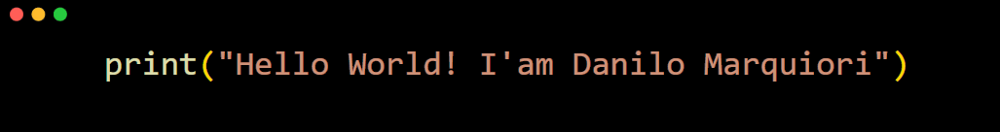

```python
class Person:
    def __init__(self, name, age, state, city, graduation, post_graduation):
        self.name = name
        self.age = age
        self.state = state
        self.city = city
        self.graduation = graduation
        self.post_graduation = post_graduation

    def introduce(self):
        print(f"Olá, meu nome é {self.name}, tenho {self.age} anos.")
	print(f"Moro em {self.city} - {self.state}.")
        print(f"Graduado em {self.graduation}")
        print(f"Pós-Graduado em {self.post_graduation}")

person = Person("Danilo Marquiori", 27, "SP", "São José do Rio Preto", "Ciência da Computação", "Inteligencia Artificial")
person.introduce()

```
----

## Trabalho atualmente
Na visão abaixo você encontrará meu cargo atual:

[](https://www.totvs.com/)
<br>
**Programador Python** \
[**TOTVS**](https://www.totvs.com/) • Full-time \
Linguagens & Tecnologias:  

----


----
## Obrigado por visitar!
Agradeço por ter visitado meu perfil do GitHub. Fique à vontade para explorar meus repositórios e ver meus projetos. Sinta-se à vontade para deixar uma estrela nos projetos que você achar interessante. Espero que você encontre algo útil ou inspirador por aqui!

----
### Onde me encontrar: 👇🏼

<div>
  <a href="https://www.instagram.com/danilomarquiori/" target="_blank"></a>
  <a href="https://www.linkedin.com/in/danilomarquiori/" target="_blank"></a>
</div>

<br>

[](https://visitcount.itsvg.in)

